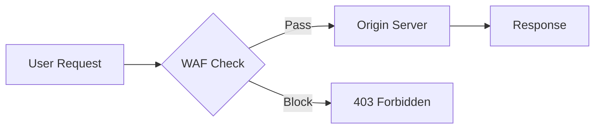
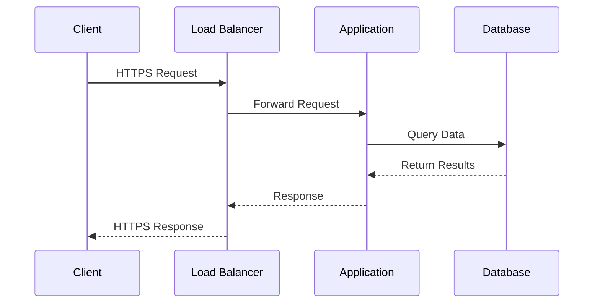
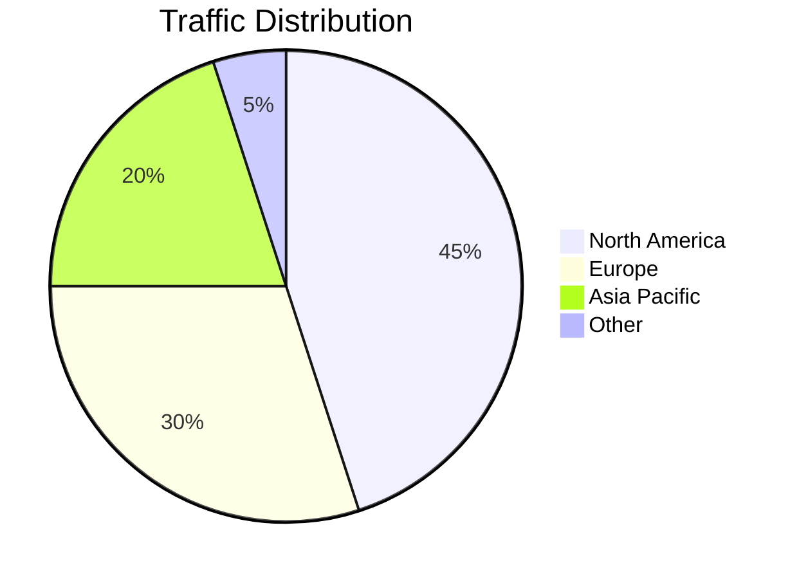
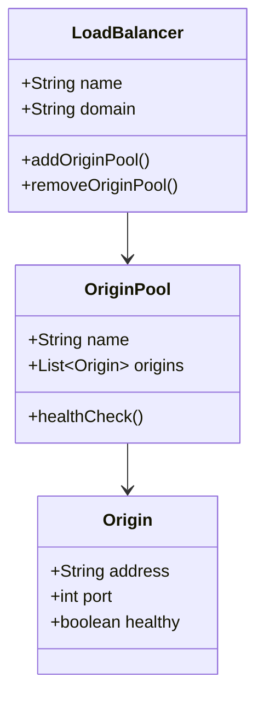
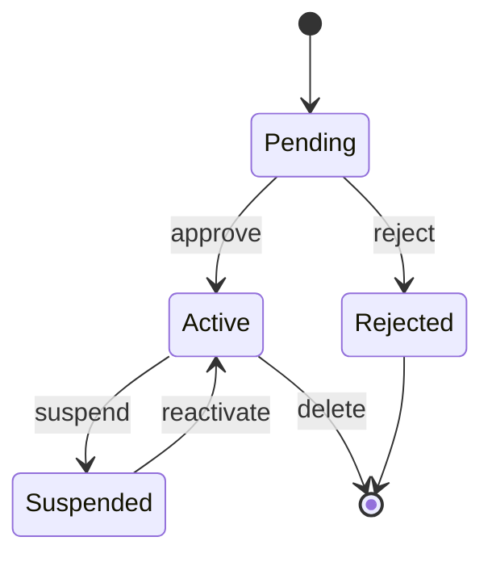
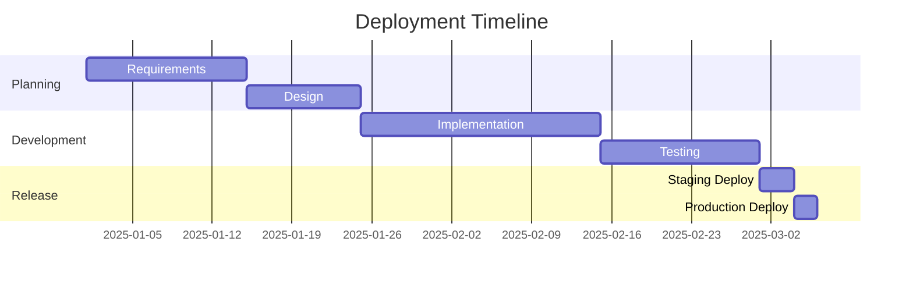

The theme includes a custom `remark-mermaid` plugin (`plugins/remark-mermaid.mjs`) that converts fenced ` ```mermaid ` code blocks into `<div class="mermaid-container">` wrappers. The Mermaid CDN script renders SVG diagrams on page load.

## Flowchart



## Sequence Diagram



## Pie Chart



## Class Diagram



## State Diagram



## Gantt Chart



## CSS Reference

### Container Styling

Mermaid diagrams are wrapped in a styled container with rounded corners and a layered box shadow:

```css
.mermaid-container {
  border: 1px solid var(--sl-color-gray-5);
  border-radius: 0.75rem;
  padding: 1.5rem;
  box-shadow: 0 2px 4px rgba(0,0,0,0.04), 0 8px 16px rgba(0,0,0,0.08), 0 24px 48px rgba(0,0,0,0.12);
  margin-block: 1.5rem;
  background: #fff;
}
```

### SVG Background Forcing

The SVG inside is forced to a white background for dark mode compatibility:

```css
.mermaid-container svg {
  background: white !important;
  border-radius: 0.5rem;
}
```

## Theme Checks

- `.mermaid-container` has white SVG background in dark mode
- Container border uses `--sl-color-gray-5`
- Container has 0.75rem border radius and layered box shadow
- `rect` and `polygon` elements have forced white fill in dark mode
- Diagrams are readable in both light and dark themes
- Mermaid CDN script loads and renders SVGs on page load
