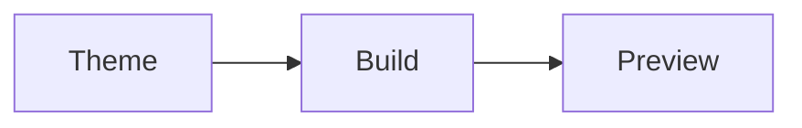

## Color Swatches

The swatch grid uses `--f5-*` CSS custom properties defined in `styles/custom.css`.

  

    
#e4002b

    
F5 Red<code>--f5-red</code>

  

  

    
#f29a36

    
Tangerine<code>--f5-tangerine</code>

  

  

    
#0e41aa

    
River<code>--f5-river</code>

  

  

    
#009639

    
Jade<code>--f5-jade</code>

  

  

    
#62228b

    
Eggplant<code>--f5-eggplant</code>

  

## Icon Grid

The icon grid uses the same pattern as the brand icons documentation page.

  

    

      
    

    
F5 Logo

  

  

    

      
    

    
F5 Logo (copy)

  

  

    

      
    

    
F5 Logo (copy 2)

  

## Mermaid in Content Collection

This small diagram verifies the remark-mermaid plugin works inside the content collection.

## Scroll-to-Top Trigger

The following content provides enough vertical height to trigger the scroll-to-top button (36px override from `custom.css`). Scroll down and verify the button appears.

### Section 1: Brand Colors

The F5 brand palette includes Cloud Red, Tangerine, River, Raspberry, Jade, Eggplant, and Bay. Each primary color has four tint/shade variants for a total of 45 colors. The palette is used in graphics and illustrations, exploring unique and modern combinations as well as monochromatic contrasts.

### Section 2: Typography

The theme uses two font families: `neusaNextProWide` for H2-H3 headings and `proximaNova` for body text and H4-H6. Headings H4 and below are set in uppercase with letter-spacing for visual hierarchy.

### Section 3: Code Styling

Code blocks use Expressive Code with a custom macOS iTerm-style terminal header. The terminal header has a `#323232` background with traffic light SVG dots. Dark mode terminal bodies use `#1a1b26`.

### Section 4: Aside Components

Asides (note, tip, caution, danger) have rounded corners at 0.75rem and a layered box shadow. Each type has a distinct border-left color for quick identification.

### Section 5: Mermaid Integration

Mermaid diagrams are rendered via a remark plugin that converts fenced code blocks to `
` wrappers. The container forces white SVG backgrounds for dark mode compatibility.

### Section 6: Dark Mode

Dark mode is the Starlight default (bare `:root`). Light mode uses `:root[data-theme='light']`. The gray scale is semantic: `gray-1` is always primary text and `gray-6` is always subtle background, with actual brightness values swapping between modes.

### Section 7: Accessibility

All color pairings meet WCAG AA contrast requirements. Body text achieves 16.3:1 in dark mode and 11.6:1 in light mode. Accent links achieve 5.6:1 in dark and 4.6:1 in light.

### Section 8: Component Library

Starlight provides Cards, CardGrid, LinkCard, Tabs, Steps, FileTree, Icon, Badge, and Aside components. All are exercised in this test suite to verify theme compatibility.

## Theme Checks

- `.swatch` border uses `--sl-color-gray-5`
- `.swatch-label` background uses `--sl-color-gray-6`
- `.icon-card-image` background is `--sl-color-gray-7` in light, `--sl-color-gray-6` in dark
- Dark mode SVGs in icon cards have `filter: invert(1)` applied
- Scroll-to-top button appears after scrolling, sized at 36px
- Mermaid diagram renders correctly inside the content collection
