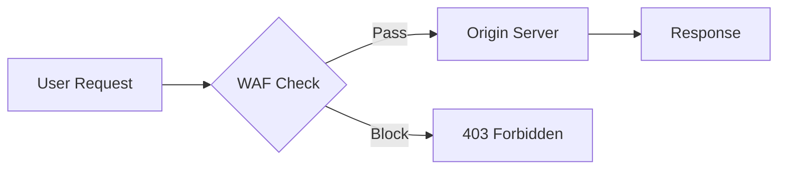
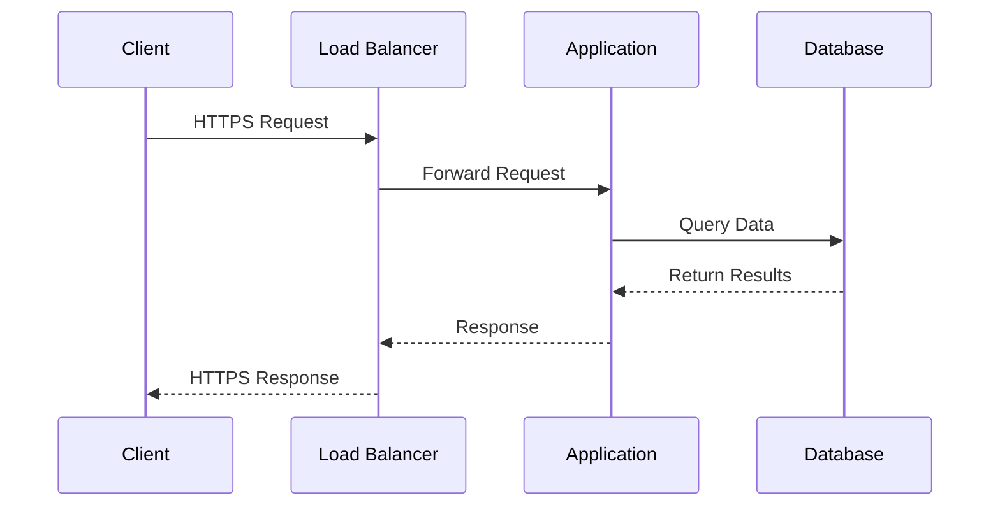
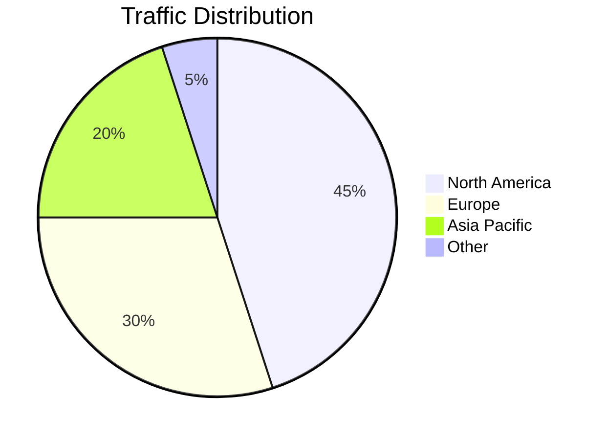
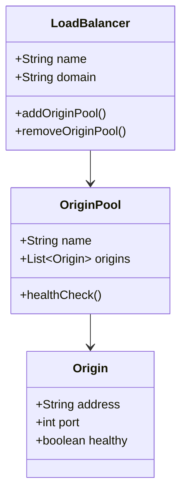
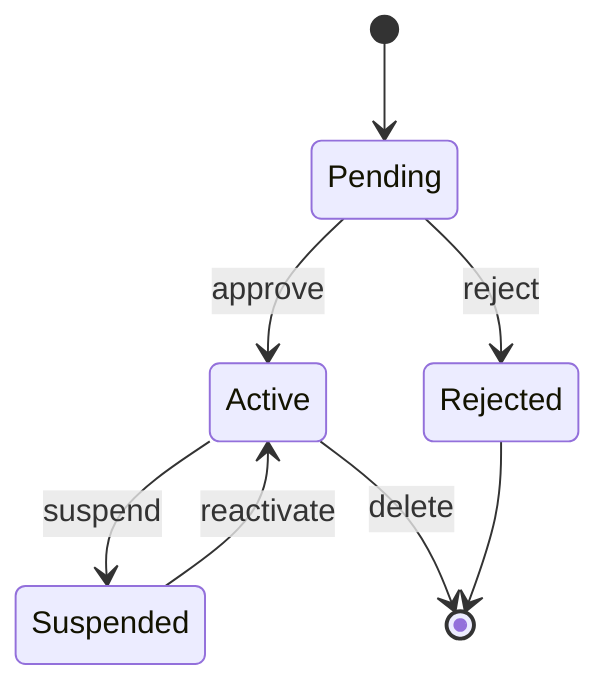
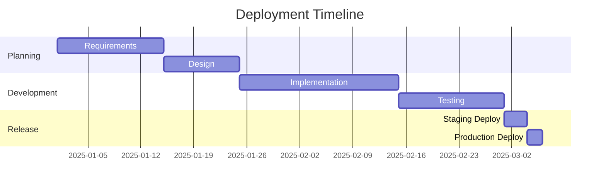

## Flowchart

## Sequence Diagram

## Pie Chart

## Class Diagram

## State Diagram

## Gantt Chart

## Theme Checks

- `.mermaid-container` has white SVG background in dark mode
- Container border uses `--sl-color-gray-5`
- Container has 0.75rem border radius and layered box shadow
- `rect` and `polygon` elements have forced white fill in dark mode
- Diagrams are readable in both light and dark themes
- Mermaid CDN script loads and renders SVGs on page load
